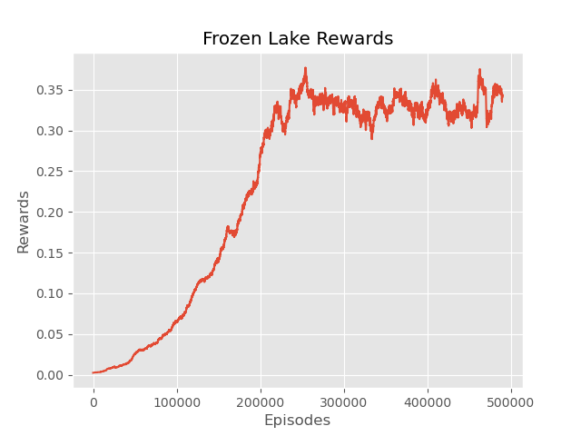

# Arctic Adventure, Q-learning for Frozen Lake

This repository contains a Python implementation of Q-Learning, a popular reinforcement learning algorithm, designed to learn optimal action-selection policies for Markov decision processes.

## Overview

Q-Learning is a model-free, off-policy reinforcement learning algorithm used to find the optimal action-selection policy for a given finite Markov decision process. It does not require a model of the environment and is capable of learning optimal policies directly from interactions with the environment.

This implementation includes a Q-learning class (*Q_learning*) that can be utilized to train agents in various environments and tasks.

## Results

The Q-learning algorithm was tested on the Frozen Lake environment, a popular grid-world environment in OpenAI Gym. The agent was able to learn an optimal policy for navigating the frozen lake and reaching the goal state.

## Usage

Please do not use this code for your homework assignments.
